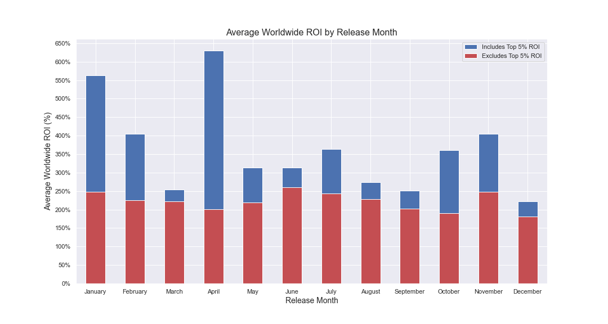
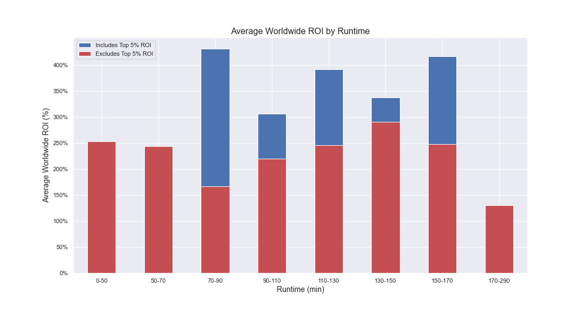
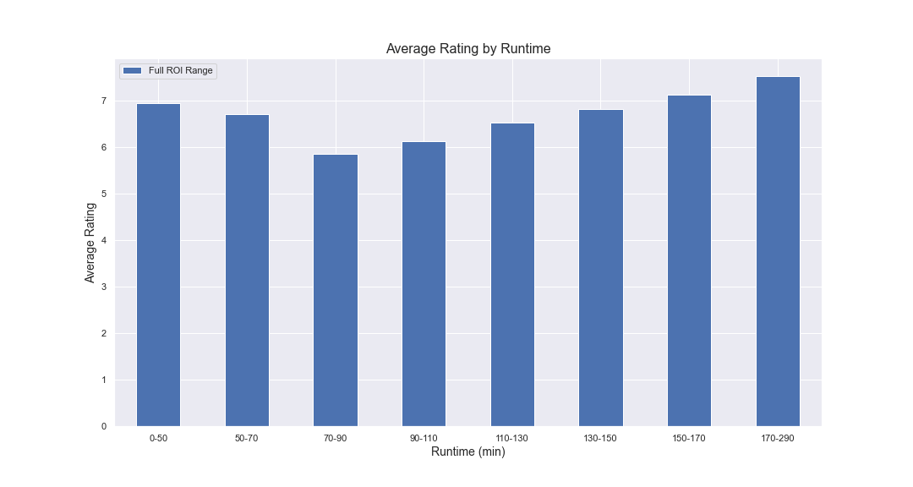
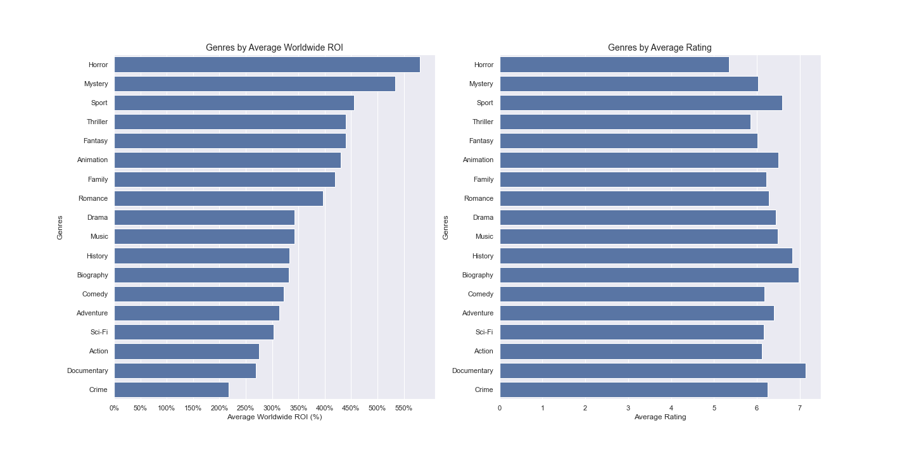

# Movie Analysis: Movie Development/Rollout Strategy

**Author**: Patrick Parkinson

## Overview

This project analyzes movie attribute and performance metric data found from [IMBD](https://www.imdb.com/) and [The Numbers](https://www.the-numbers.com/) to help Microsoft's new Movie Studio better determine what movie types and rollout strategies will be most effective. The data analysis shows that movie profitability and ratings vary by runtime, release date, and genre. Microsoft can use this information to rollout the most cost efficient and popular film offering.

## Business Problem

As a leading technology company, Microsoft is looking to expand their product offering to include original movie content. The Microsoft Movie Studio will compete directly with leading video content providers such as Netflix, HBO, and Hulu providing additional revenue streams while expanding their customer base for direct marketing of separate products and services. Microsoft is looking to complete an initial investigation into the performance of films in the movie industry to better understand the types of movies and launch strategies that are most effective. As a new film producer it will be critical for Microsoft to efficiently invest in their initial films while developing content that users enjoy. For this reason Return on investment (ROI) and viewer ratings have been analyzed against film attributes such as genre, runtime, and release date to guide Microsoft's initial film strategy.    

## Data

The data used for this analysis is from the following sources:

- [IMBD](https://www.imdb.com/): Leading online database for films including various movie attributes and viewer reviews. Data for this analysis is located within a SQLite database
- [The Numbers](https://www.the-numbers.com/): Data website that tracks box office revenue by film. Data for this analysis is located in a .csv file

Target variables for analysis include the following:

- Performance metrics
    - Production budget and worldwide income (TN): Used to calculate a worldwide return on investment to understand the efficiency and profitability of the movie investment
     - Average rating (IMBD): Used to understand the movie popularity and how well the movie was received by viewers
- Movie attributes (IMBD)
     - Runtime
     - Release date
     - Genre
 
It is unclear whether the datasets provided represent a certain movie populations. This would be worth further investigation in the future should any differences in population sample skew results.

## Methods

This project uses descriptive analysis to compare the movie attributes and performance metrics of interest. Desired variables were first merged together in a single dataframe followed by data cleaning and feature engineering to produce additional variables of interest. Exploratory data analysis was then used to calculate descriptive statistics and address outliers. Finally, various visualizations were used to better understand the data and formulate recommendations. 


## Results

Without the top 5% producers by ROI, movies released in January, June, and  November produced the highest average ROI. 


Excluding the top 5% ROI producers, there is a steady increase in average ROI in runtimes from 90 - 150min, stabalizing through 170min. Average rating also steadily increases over this range. 



There is a vast difference in ROIs for different movie genres. Sports, animation, family, and romance movies all have average ROIs greater than 350% and ratings greater than 6.



## Conclusions

This analysis leads to three recommendations for movie development under the new Microsoft Movie Studio:
- **Release movies throughout the year to remain competitive but favor release dates around January, June, and November**. While hits can occur any time throughout the year, these months yielded the highest average ROI for the bulk of the movies reviewed. These months also correlate to times where the total number of movies released are lower (see release date EDA) which will allow for lower competition at the box office. 
- **Focus on movies with runtimes from 110 - 170min**. Movies with these runtimes have the highest ROI on average for the bulk of the movies analyzed. These runtimes also have high ratings. While movies with higher runtimes had even higher ratings there is not enough data available to make the determinations for movies in the highest runtime range. 
- **While a wide variety of genre's are recommended to compete with other movie content producers and appeal to wide audience, focus initial efforts on the following genres: sports, animation, family, romance**. These movies yielded both the highest ROI (greater than 350%) and the highest user ratings (greater than 6). 

The below notes have been included for consideration:
- Note that while the averages analyzed in this activity do show differences in ratings and ROI by movie attributes, there is no statistical correlation between these variables and movies produced according to these recommendations are not intended to predict results. There are several other variables that influence movie success but the relative differences in historical averages in this report are helpful in guiding movie selections. 
- Analysis assumes that the production_budget from the TN dataset is representative of total development costs for a given movie. It would be helpful to confirm this to ensure ROI calculations are accurate. 
- In future, it would be helpful to have a better understanding of the source of the raw data sets provided. It was not clear whether the IMBD or TN datasets only represented a certain population of movies which may skew the results and recommendations.
- The genre analysis compares genres against vastly different data sizes. In the future it would be helpful to have larger and more consistent sample sizes for each genre.
- In future, additional movie parameters should be examined to help guide development strategy such as producers, writers, and actors.
- In future, it would also be helpful to further define performance metrics to better understand where movie revenue is coming from (box office, merchandise, online streaming, etc.) so Microsoft can better plan it's commercialization strategy.

## For More Information

Please review our full analysis in [our Jupyter Notebook](./Project_Notebook.ipynb) or our [presentation](./DS_Project_Presentation.pdf).

For any additional questions, please contact **Patrick Parkinson**

## Repository Structure


```
├── README.md                      <- The top-level README for reviewers of this project
├── Project Notebook.ipynb         <- Narrative documentation of analysis in Jupyter notebook
├── DS_Project_Presentation.pdf    <- PDF version of project presentation
├── data                           <- Sourced externally
└── images                         <- Produced by code
