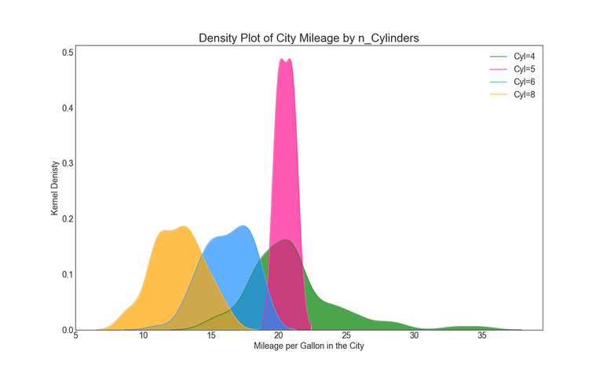

## Microsoft should make Clown-based-Horror Movies with Judd Apatow and Lawrence Fishburn
**Authors**: Student1, StudentQ, Student_Other

##### Repository Structure:

```

├── __init__.py                     <- .py file that signals to python these folders contain packages.
├── README.md                       <- The top-level README for reviewers of this project.
├── dsc-mod1-project-template.ipynb <- narrative documentation of analysis in jupyter notebook
├── presentation.pdf                <- pdf version of project presentation
├── data
│   ├── README.md                       <- lower-level README describing the data sources provided
│   ├── file_1                          <- sample data file
│   ├── file_2                          <- sample data file
│   └── file_3                          <- yet another sample data file
├── data_cleaning_code
│   ├── __init__.py                     <- .py file that signals to python these folders contain packages.
│   └── data_cleaning.py                <- .py script used to pre-process and clean data
└── images_and_code
    ├── __init__.py                     <- .py file that signals to python these folders contain packages.
    ├── visualizations.py               <- .py script to create finalized versions of visuals for project
    └── images                          <- both sourced externally and generated from code

```

### Business problem:
Microsoft* sees all the big companies creating original video content, and they want to get in on the fun. They have decided to create a new movie studio, but the problem is they don’t know anything about creating movies. 

Our team analyzied movie data from  [Box Office Mojo](www.boxofficemojo.com), [IMDB](www.IMDB.com), [Rotten Tomatoes](www.rottentomatoes.com), and [TheMovieDB.org](www.TheMovieDB.org) to help them better understand the movie industry. 

### Recommendations:

After lookin at x, y, and z we focused on number of clowns per movie, combined with Director of the movie, as the most useful metrics to measure movie potential. We created a new variable to capture to the clowns to actors ratio and as you can see in these two visuals that have nothing to do with our analysis, they clearly show that point:

#### Visual 1


#### Visual 2



### For further information
Please review the narrative of our analysis in [our jupyter notebook](./dsc-mod1-project-template.ipynb) or review our [presentation](./project_slide_template.pdf)

For any additional questions, please contact **email, email, email)


*Microsoft was not actually involved in the commission of this project


